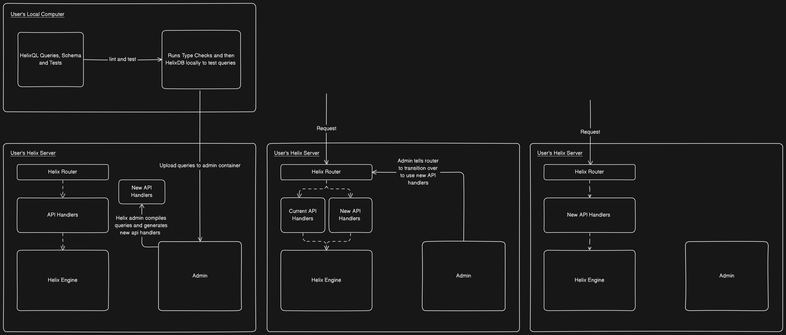

### Overview

##### Router
- Parse request
- Verify request
- Route request to api handler

##### API 
- Pull thread from thread pool
- Transfer request to thread with corresponding handler
- Execute request

##### Graph Engine
- Core graph implementation
- Interface with rocks db
- Handles calls from API via internal UNIX socket

#### Process of Uploading Queries
