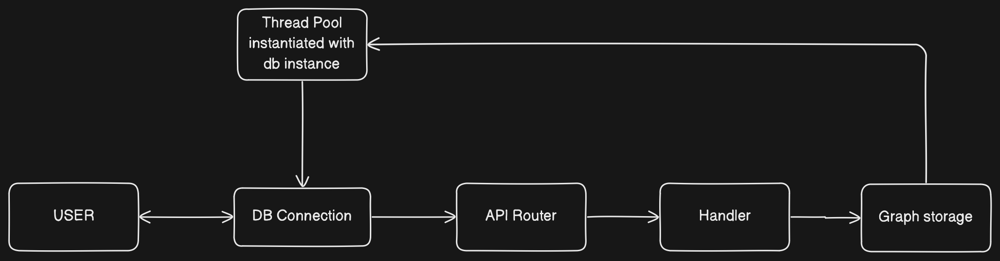

## Plan 

- Have thread pool with N number of threads that will be instanciated with arc mutex instances of the graph storage
- These instances will be pavssed to router which will lock the mutex and pass the graph reference to the handler to perform the operation, dropping the lock after. 

- The API Router is a general purpose bit of code that parses the incoming request, and then calls the appropriate handler function. The handler function is responsible for performing the actual work of the API call.
- The connection will just be a tcp stream that will run in the fetched thread from the thread pool. 

#### Process
1. DB connection is tcp stream
2.  When connection is made, get thread from pool and move tcp stream into thread. Stream will receive request on thread and read into router passing thread's storage instance.
3. Router uses thread's storage instance to process job

